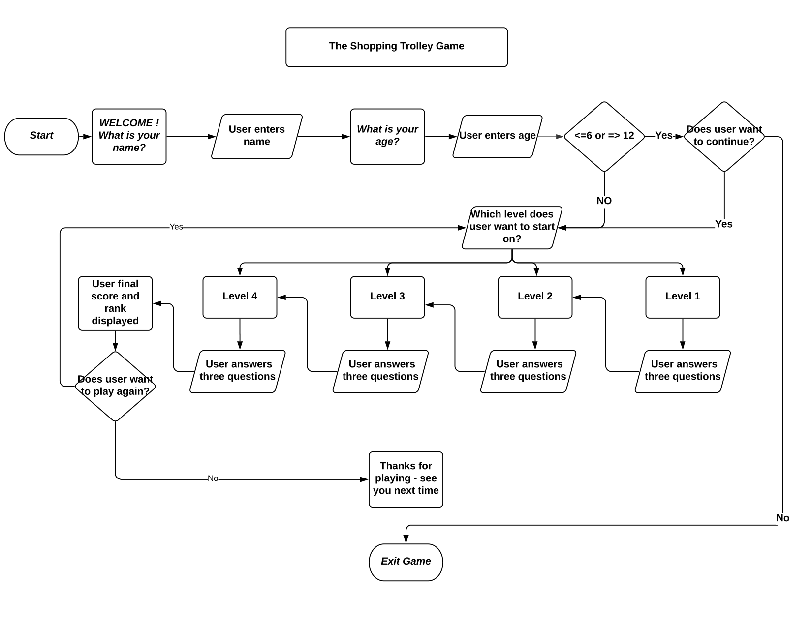
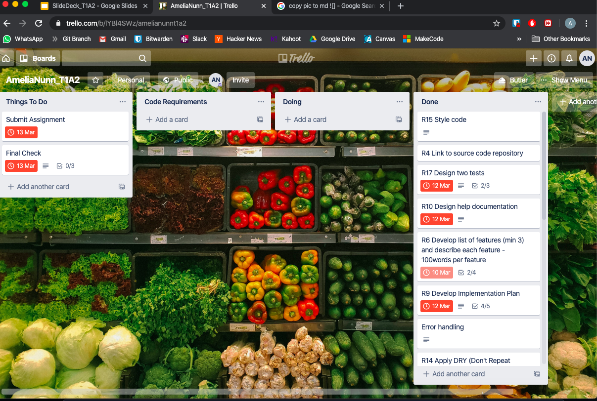

# TERMINAL APPLICATION

## + - / x Shopping Trolley x / - +

## 1.0  SOFTWARE DEVELOPMENT PLAN
---
[Link to Github Repository](https://github.com/highpitchit/AmeliaNunn_T1A2)

## 1.1 PURPOSE AND SCOPE
Basic mathematics is a fundamental life skill which is required to negoiate all facets of life. Getting a grasp on mathematics early in life has been proven to assist with problem solving, confidence and the ability to self learn. Mathematics is best learnt from practicing and the idea of implementing the game within a supermarket will give the player practice they can relate to in the real world. 

This game is targeted for ages seven to eleven and is designed in align with the requirements of mathematics in the Australian curriculum.   

The Shopping Trolley Game is an interactive, multi-level game which engages children of relevant age to practice their maths skills. The game is set out to be in a supermarket with the player using maths skills to complete their shop. 

The four level game is set out in four levels with the difficulty increasing as the game progresses. The game has questions on areas such as; addition and subtraction, multiplication, fractions, percentages, estimation, money and change.

For each level, the player will answer three questions before they progress to the next level. Each correct answer will attain points, with the points increasing as the player advances to the next level. Once they have completed the four levels their overall score will be displayed and they will be told how they ranked against other players. They will then have the choice to either begin again or exit the game. 

REFERENCES:              
https://www.qcaa.qld.edu.au/p-10/aciq/learning-areas/mathematics/australian-curriculum
https://www.australiancurriculum.edu.au/f-10-curriculum/mathematics/rationale/

## 1.2 FEATURES 

#### Feature 1 - Four Levels
The game has four levels where the user can pick which level they would like to begin on and after completing the level the game will progress to the next level. The difference in the levels will determine what maths is required as the difficulty increases as the player progresses in the levels.  
**Level 1**  is the beginner level, aimed at 7 year olds. It includes basic addition and subtraction of supermarket items.     
**Level 2** is the intermediate level which is aimed at 8 - 9 year olds. It includes basic multiplication, fractions, handling money and receiving change.    
**Level 3** is the advanced level, which is targeted to children aged 9 to 10. It includes rounding money and adding of fractions.          
**Level 4** is the expert level, which is targeted to children aged 10 to 11 years old. It includes a revision of the previous concepts, addition and subtraction of decimals, and working out the cost of produce after a 10%, 25% and 50% percentage discounts. 

#### Feature 2 - Random Question Generator
The game uses a random question generator('rqg') which loops through the level's questions three times before moving onto the next level. Each question and associated answer is located within a hash in an array. Every level has its own array with 6 hashes containing two keys and values for the questions and answers. Hence the random question generator sorts through the levels question/answer array and outputs the question. The user then enters their answer and they will be told whether they are correct or incorrect. The loop will then use the rqg until three questions have been asked. 
To assure the questions are not repeated within the level, an additional function was used in the loop "delete_if" which temporarily deletes the question in the loop so that no question is repeated.

#### Feature 3 - High Score generator
The score generator records the user score for the game and compares it with previous attempts at the game, sorting it from the highest to lowest score. The score is calculated by multiplying the number of correct questions by the level points whereby incorrect answers receive zero points Level 1 questions are worth 200 points, Level 2 questions are worth 400 points, Level 3 questions are worth 600 points and Level 4 questions are worth 800 points.

#### Feature 4 - Write and Read to CSV 
High scores were able to be generated by having the historical record saved in a file. The score from each game was outputted to the file, then the code was sorted through to input the rank of the player back into the game. This feature was particularly important as providing a final score for the game gives them incentive to try again while practicing maths to beat their previous score.
#### Feature 5 - Data Input 
As the game is recommended to be played by a certain age  group the user is required to input their age at the beginning of the game where they can decide if they are to continue or exit.

## 1.3 GEMS
Four gems were used in the development of the application, these were;
    
- colorize 
    - to colour the code
- tty-font 
    - gave title headings at different points in the game
- tty-prompt 
    - gives user the ability to start the game at any level using the up/down keys and enter
- csv 
    - provided the game with the ability to store the scores and output at the end of the game

## 1.4 OUTLINE OF USER INTERACTION AND EXPERIENCE
Once the user has entered the game, the user will be prompted to enter their name. The game then welcomes them to the game and requests their age. If they are within the age range of 7 to 11 they will then continue on to select the level they wish to play. If they are outside the age range then they will be asked whether they wish to continue or not. If they don't want to continue the game will end but if they do want to continue they will be prompted to select the level they wish to start on. Selecting the level is completed with the use of the up and down arrows followed by enter. Once they are in the level the rqg will output a question to the screen which requires the user to provide an answer. If they provide the correct answer they will receive "Correct" else if they answer wrong they will receive "Incorrect". The game only take integers as answers but if the user used a string or alphanumeric character as an answer they would simply receive "Incorrect" and the game would continue. Hence by allowing multiple data types as possible answers the user will receive "Incorrect" if an error in the answer is found. Another part of handling errors which could occur is if user enters age <=6 or => 12. However, by using an if statement this error is caught by the option to continue anyway if they don't fulfill the age requirement. 
For each level, three questions are required to be answered before moving on to the next level.Once they have completed Level 4 they will be told their final score followed by their ranking. They then have the choice to continue playing or 

## 1.5 DIAGRAM OF CONTROL FLOW

[Flow Diagram](./docs/Flowchart.png)

## 1.6 DEVELOP IMPLEMENTATION PLAN

The implementation plan was developed in Trello using the Assignment 2 - Terminal App criteria sheet and the associated rubric. Each requirement of the criteria sheet was given a card wih a due date and checklist of items that will ensure the task is complete. The associated rubric information for the highest mark was also added onto each applicable card. Four lists were made up on the Trello board ~ Documentation, Code, Doing and Done. The board can be seen below.

[Open Implementation Plan](https://trello.com/b/lYBl4SWz/amelianunnt1a2)

## 1.7 HELP DOCUMENTATION

### How to install

- how to install documentation
- any dependencies required by the application to operatre
    gems?
- any system/hardware requirements
ie suitable ruby interpreter

How to install:
Run ruby ./code.rb

Ruby 7.0
MacOS

# Extra

Marking 
- use ruby style guide on git hub
